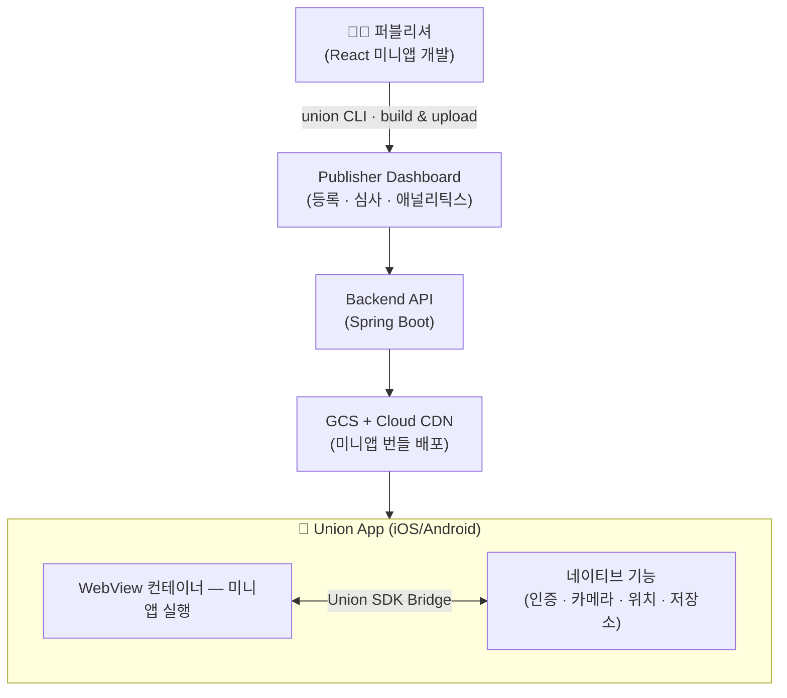

# Union (유니온)

**대학생 전용 미니앱 슈퍼앱 플랫폼** — 단국대학교 캡스톤디자인 프로젝트

퍼블리셔(개발자, 학생회, 동아리)가 React 기반 미니앱을 만들면, 
대학생 사용자들이 하나의 앱 안에서 다양한 서비스를 이용할 수 있습니다.

[**퍼블리셔 대시보드 바로가기 →**](https://union-phi.vercel.app)

## 왜 Union인가?

AI와 바이브 코딩의 발전으로 누구나 소프트웨어를 만들 수 있지만, **시장에 내놓는 것**은 여전히 어렵습니다.
앱 스토어 등록비, 심사 프로세스, 마케팅 비용, 초기 사용자 확보 — Union은 이 장벽을 없앱니다.

- 앱 스토어 등록 없이 미니앱을 즉시 배포
- 캠퍼스라는 폐쇄적 공동체에서 빠르게 사용자 확보
- 학생회/동아리가 축제 앱, 웨이팅 앱, 소개팅 앱 등을 직접 제작 가능

## 아키텍처

## 레포지토리

| 레포 | 설명 | 언어 | 최근 커밋 |
|------|------|------|-----------|
| [union-ios](https://github.com/dku-union/union-ios) | iOS 슈퍼앱 |  |  |
| [union-sdk](https://github.com/dku-union/union-sdk) | Bridge SDK + CLI |  |  |
| [union-app-backend](https://github.com/dku-union/union-app-backend) | 백엔드 API |  |  |
| [union-dashboard](https://github.com/dku-union/union-dashboard) | 퍼블리셔 + 관리자 대시보드 |  |  |

## 기술 스택

| 영역 | 기술 |
|------|------|
| iOS App | Swift / SwiftUI / TCA (The Composable Architecture) |
| Bridge SDK | TypeScript / postMessage 프로토콜 |
| CLI | TypeScript / Commander.js / Vite |
| Backend | Spring Boot / PostgreSQL / Redis |
| Dashboard | Next.js |
| 미니앱 런타임 | React → WebView |
| 인증 | 학교 이메일 인증 + JWT (access/refresh) · 미니앱은 RS256 ID 토큰 (JWKS 검증) |
| 배포 | Cloud Run (API) · GCS + Cloud CDN (미니앱 번들) · Vercel (대시보드) |

## 팀원

| 이름 | GitHub | 역할 | 담당 |
|------|--------|------|------|
| 송준서 (팀장) | [@JunSeo99](https://github.com/JunSeo99) | App Frontend + SDK | iOS 앱 (SwiftUI/TCA), Bridge SDK, CLI |
| 조성빈 | [@ricky00-dev](https://github.com/ricky00-dev) | Backend | Spring Boot API 서버 |
| 이용찬 | [@lee-y-ch](https://github.com/lee-y-ch) | Publisher Frontend | 퍼블리셔 대시보드 (Next.js) |
| 이장원 | [@jangwonii](https://github.com/jangwonii) | Admin Frontend | 관리자 대시보드 (Next.js) |

> 단국대학교 소프트웨어학과 캡스톤디자인
